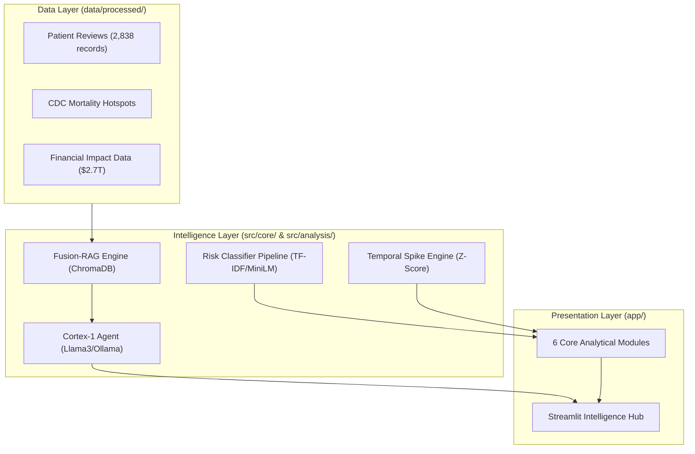

# 🧠 Nexus-Cortex: Substance Abuse & Economic Intelligence

An advanced public health surveillance platform designed for the **NSF NRT Project**. Nexus-Cortex fuses **CDC provisional mortality data** with **unstructured clinical patient narratives** to deliver a high-fidelity intelligence suite for drug and alcohol risk detection.

---

## 🏛️ System Architecture

Nexus-Cortex uses a **Fusion-RAG** (Retrieval-Augmented Generation) architecture to ground AI reasoning in real-world clinical and evidence-based data.



---

## 📂 Project Structure

```text
.
├── app/
│   ├── streamlit_app.py          # Main Intelligence Dashboard entry point
│   └── style.css                 # Professional "Laboratory Light" design system
├── data/
│   ├── chroma_db/                # Local Vector Database (ChromaDB)
│   └── processed/                # Refined Parquet & JSON artifacts
├── report/
│   └── NSF_NRT_Final_Report.md   # Comprehensive 5-page research report
├── src/
│   ├── core/
│   │   ├── agent_model.py        # Cortex-1 Agent orchestration
│   │   └── rag_engine.py         # Multi-source Fusion-RAG logic
│   ├── analysis/
│   │   ├── risk_classifier.py    # ML training (Rule-Based, TF-IDF, SVM, MiniLM)
│   │   ├── temporal_behavioral.py # Real-time spike and intensity tracking
│   │   ├── early_warning.py      # Clinical distress triage
│   │   └── economic_impact.py    # Societal burden modeling
│   └── data_processing/
│       ├── drug_review_etl.py    # Clinical dataset processing
│       └── cdc_data.py           # CDC API & mortality integration
└── requirements.txt              # Project dependencies
```

---

## 🔬 Core Research Modules

- **Risk Signal Detection**: Implements a 4-approach competitive pipeline (Lexicon, TF-IDF+LR, TF-IDF+SVM, and MiniLM Embeddings) to identify high-risk clinical events.
- **Temporal Dynamics**: Uses Z-score anomalous detection to identify "spikes" in community distress and tracks risk intensity trends across substance classes (Opioids, Alcohol, Stimulants).
- **Explainable Reasoning**: The **Cortex-1** agent provides auditable reasoning by retrieving and citing specific clinical reviews and mortality data points through its evidence panel.
- **Economic Intelligence**: Models the **$2.7 Trillion** societal burden, breaking down healthcare costs vs. productivity losses.

---

## 🚀 Setup & Execution

### 1. Environment
Requires Python 3.10+ and a local instance of [Ollama](https://ollama.com/) running.

```bash
# Setup venv
python3 -m venv .venv
source .venv/bin/activate
pip install -r requirements.txt
```

### 2. Run Dashboard
```bash
streamlit run app/streamlit_app.py
```

> [!TIP]
> Use the **"Re-index Fusion-RAG"** button in the sidebar upon first run to initialize the local vector database.

---

## ⚖️ Ethics & Governance

This is a **clinical intelligence prototype** developed for research purposes.
- **Safety**: The models are trained on real-world patient testimonials but are provided for surveillance analysis, not diagnosis.
- **Crisis Support**: If you or someone you know is in crisis, call or text **988** in the US/Canada.

---
**Nexus-Cortex 2.0** | *Advancing Clinical Intelligence for Public Health*
