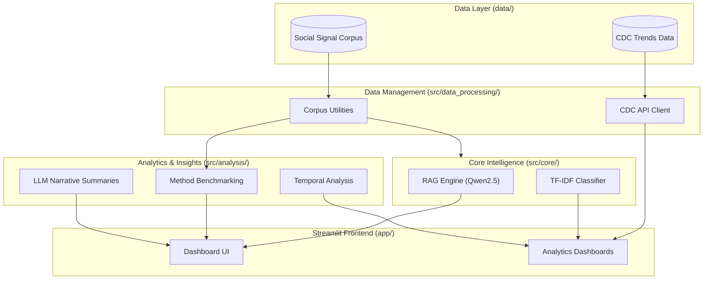

# Substance-Related Risk Signals: NSF NRT Prototype

An advanced public health surveillance demonstration dashboard combining **CDC overdose trends** with **multi-method NLP pipelines**. This prototype showcases the integration of rule-based systems, traditional Machine Learning (ML), Deep Learning (DL), and local **Retrieval-Augmented Generation (RAG)** using local Large Language Models (LLMs).

---

## System Architecture



---

## Features

- **Multi-Model Comparison**: Evaluates Lexicon, TF-IDF (Logistic Regression, Random Forest, SVM), and Sentence Embeddings on a stratified hold-out set.
- **RAG Risk Analysis**: Uses a local **Qwen2.5-0.5B** model to analyze queries by retrieving context from the social signal corpus.
- **Temporal Analysis**: Detects spikes in distress and substance mentions with automated **LLM-powered narrative summaries**.
- **Evidence Retrieval**: Highlights token impact and retrieves similar historical cases for transparency.
- **Public Health Integration**: Visualizes CDC provisional overdose trends alongside synthetic social media surveillance.

---

## Setup & Run

### 1. Environment Setup
Requires Python 3.10+ and 8GB+ RAM.

```bash
cd "/Users/kukulad/Desktop/NSF_NRT Project"
python3 -m venv .venv
source .venv/bin/activate
pip install -r requirements.txt
```

### 2. Launch the Dashboard
```bash
streamlit run app/streamlit_app.py
```

*Note: The first run will download approx. 1GB for the local model (Qwen2.5-0.5B) and MiniLM embeddings.*

---

## Project Layout

| Path | Purpose |
|------|---------|
| `app/streamlit_app.py` | Main Streamlit dashboard UI |
| `src/core/` | Core engines: RAG orchestration and TF-IDF models |
| `src/analysis/` | Analytics: Spikes, weekly trends, and method benchmarking |
| `src/data_processing/` | Data handling: CDC API clients and corpus utilities |
| `src/utils/` | Shared utilities: Embeddings, rules, and data splitting |
| `data/` | Data assets: Social signal corpus and local cache |
| `tests/` | Unit and integration testing suites |
| `requirements.txt` | Project dependencies |

---

## Ethics & Governance

This is a **methodological prototype** using synthetic text. It is NOT a diagnostic tool. In clinical or live environments, strict governance and human-in-the-loop validation are required. 
- US Crisis Resource: **988**
